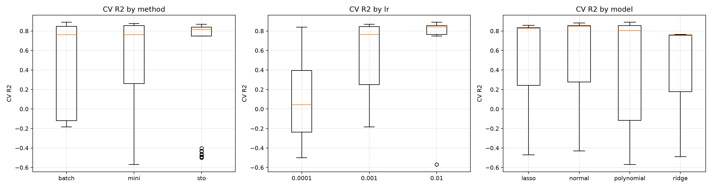
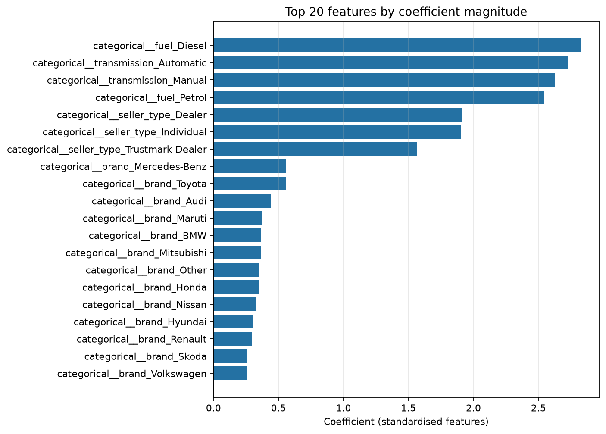

# A2: Predicting Car Price — linear regression from scratch

Continues from [A1](https://github.com/st127314/ml-ca-01). Same dataset, same cleaning,
but the modelling is replaced with a `LinearRegression` written from scratch and extended
from the class notebook `03 - Bias-Variance Tradeoff and Regularization.ipynb`.

Three parts:

1. `app/code/linear_regression.py` — the class, with `r2`, Xavier initialisation, momentum
   and a coefficient-based feature importance plot added.
2. `notebooks/02_car_price_scratch_regression.ipynb` — 144 configurations compared under
   cross validation, all tracked in MLflow.
3. `app/` — the A1 web app with a second prediction page served by the new model.

## Where the model class lives, and why

In `app/code/linear_regression.py` rather than inside the notebook. Pickle stores the
*import path* of a class, not its code, so a class defined in a notebook is recorded as
living in `__main__` and the web app would fail to load the saved model. The notebook
imports the module and prints its full source, so the implementation is still readable in
one place for marking.

`app/code/data_prep.py` holds the cleaning for the same reason: the notebook and the app
cannot drift apart if there is only one definition of "the cleaned dataset".

## Task 1 — the class

Added on top of the class version:

- **`r2()`** — 1 − SS_res/SS_tot. Goes negative when a model does worse than predicting the
  mean, which turns out to be a useful signal: a learning rate of 0.0001 with batch gradient
  descent produces exactly that inside the epoch budget.
- **Xavier initialisation** — weights drawn from U[−1/√m, 1/√m], selectable against the
  original zeros. On a convex loss both land in the same place, which the notebook shows;
  the reason to implement it is the habit for deeper models.
- **Momentum** — with a selectable coefficient, see the note below.
- **`feature_importance()`** — ranks features by coefficient magnitude, keeping the sign in
  the bar colour. Only meaningful because every feature is standardised first; otherwise a
  coefficient reflects the unit its feature is measured in rather than its importance.

Two bugs in the class version are fixed, both commented where they occur: `val_loss_old`
was set once before the fold loop rather than per fold (so a low loss in fold 1 could trip
early stopping on fold 2's first epoch), and `prev_step` needs resetting per fold or
momentum carries velocity across folds.

### A discrepancy in the assignment's momentum pseudocode

The brief gives:

```
step  = alpha * grad
theta = theta - step + momentum * prev_step
prev_step = step
```

Read literally, `prev_step` holds `alpha * grad`, which points **uphill**, so adding it back
works against the descent. Measured, it converges *slower* than no momentum at all — the
opposite of what the brief's own prose describes:

| Variant | 200 epochs | 2000 epochs |
| --- | --- | --- |
| No momentum | R² 0.924 | R² 0.998 |
| Brief's pseudocode | R² −0.810 | R² 0.922 |
| Standard momentum | R² 0.998 | R² 0.998 |

If `prev_step` instead holds the update actually applied (`−step`), the same line is textbook
momentum. Both are implemented and selectable via `momentum_variant`; `standard` is the
default because it matches the described behaviour. The table above is the notebook's
synthetic problem, where the true weights are known. On the real data the grid measures the
axis that matters for the experiment — standard momentum against none — at median CV R²
0.762 with against 0.243 without.

## Task 2 — the experiment

| Axis | Values | n |
| --- | --- | --- |
| Model | normal, lasso, ridge, polynomial | 4 |
| Momentum | without, with | 2 |
| Gradient descent | batch, mini-batch, stochastic | 3 |
| Initialisation | zeros, xavier | 2 |
| Learning rate | 0.01, 0.001, 0.0001 | 3 |

144 configurations, 3-fold cross validation, 432 fits, plus one refit of the winner on
the full training split before it is scored on the test set. In MLflow that is 145 parent
runs and 435 nested per-fold runs.

**On the epoch budget.** An epoch means something different per method: batch does one
weight update per epoch, mini-batch about 109, stochastic 5,444. Giving all three the same
number of epochs would compare how many updates each was allowed, not the methods. Measured
first: batch at 500 epochs reaches R² −0.07 and needs around 5,000 to converge, while
stochastic is already at 0.85 after 5. The budget equalises updates roughly and is then held
fixed across every configuration.

## Results

Selected by cross-validated R² alone: **polynomial features, batch gradient descent, Xavier
initialisation, learning rate 0.01, momentum 0.9** — CV R² 0.8888. The test set was scored
once, by a single refit of that configuration.

| Metric | Value |
| --- | --- |
| R² (log scale) | **0.876** |
| MSE (log scale) | 0.0678 |
| R² (price scale) | −14.88 |
| R² (price scale, excluding one row) | 0.868 |

Log-scale figures are the headline because log price is what the model minimised and what
cross-validation selected on. The −14.88 is one car: the most expensive in the test set is
predicted at 83.7M against an actual 10M, and squaring a 73M error after `exp()` swamps the
other 1,360 rows. Reported rather than trimmed, on the notebook and on the web page.

What the grid found, one axis at a time (median across the grid, because diverged runs make
a mean meaningless):

| Axis | Best setting | Median CV R² | Worst setting | Median CV R² |
| --- | --- | --- | --- | --- |
| Learning rate | 0.01 | 0.833 | 0.0001 | −0.293 |
| Momentum | with | 0.762 | without | 0.243 |
| Method | stochastic | 0.754 | mini-batch | 0.277 |
| Model | normal | 0.838 | polynomial | 0.261 |
| Initialisation | zeros | 0.753 | xavier | 0.748 |

Learning rate dominates; momentum is the next largest effect; initialisation makes no
difference to where a convex loss ends up, only to how fast it gets there. Polynomial has
the worst median and the best single run — it wins by 0.008 R² when everything else is right
and diverges outright under stochastic descent.





### Against the A1 model

A1's Random Forest was trained on the same cleaning and the same split, so it scores on
exactly the same 1,361 test rows (notebook §2.7):

| Metric | A1 Random Forest | A2 scratch linear |
| --- | --- | --- |
| R² (log) | **0.909** | 0.876 |
| R² (price, same row excluded from both) | **0.910** | 0.868 |
| Median absolute % error | **11.3%** | 14.4% |
| Priced within 20% of actual | **73.5%** | 64.8% |

**The forest is more accurate on every measure**, and the notebook and the web page both say
so. What the from-scratch model wins on is everything else: 5.9 KB against 18 MB, one dot
product per prediction, and 105 coefficients you can read off and explain to a customer.
That — not accuracy — is the basis on which the new page recommends it.

The full written report, with the findings discussion and four MLflow screenshots
(`figures/mlflow_*.png`), is the last section of the notebook.

## MLflow

Local SQLite backend by default, written to `mlflow.db`. MLflow 3 retired the plain
`./mlruns` file store, and SQLite is the recommended replacement — still one local file with
no server to run.

```bash
mlflow ui --backend-store-uri sqlite:///mlflow.db
```

Then open `http://127.0.0.1:5000`.

To use a remote tracking server instead, export `MLFLOW_TRACKING_URI` before starting
Jupyter; the notebook picks it up and needs no other change.

The class logs the loss curve every 50 epochs rather than every epoch. As it stands the
tracking database holds 28,216 metric rows in 9.2 MB. Per-epoch logging is 50 times that —
a first attempt had reached 548,000 rows and 135 MB before I stopped it — and the curves
look the same either way.

## Running it

This repo has its own virtual environment, separate from A1's.

```bash
python3.13 -m venv .venv
./.venv/bin/pip install -r app/requirements.txt
./.venv/bin/pip install "mlflow==3.15.2" pytest jupyterlab matplotlib seaborn

# tests: the class is checked on a synthetic problem where the answer is known
./.venv/bin/python -m pytest

# the experiment
./.venv/bin/jupyter lab notebooks/02_car_price_scratch_regression.ipynb
```

`requirements-dev.lock.txt` records the exact versions this was developed against.

Two things worth knowing about the install:

**Pin mlflow explicitly.** Installing it unpinned alongside everything else lets pip
backtrack all the way to mlflow 1.27, which then fails to import against a modern
protobuf. `mlflow==3.15.2` avoids the whole resolution.

**mlflow declares `pandas<3`, and this project uses pandas 3.0.5 anyway.** The pin is
conservative rather than a real incompatibility - nested runs, metric logging and
`search_runs` were all verified working on pandas 3, and the full 144-run sweep ran on
it. Keeping 3.0.5 matters because it is what `app/requirements.txt` installs into the
Docker image, and training and serving should not be on different pandas majors. `pip`
prints a dependency-conflict warning on install; it is expected.

**matplotlib is not a runtime dependency.** `linear_regression.py` imports it lazily
inside `feature_importance()`, because the web app imports that module only to unpickle
the model and never plots. That keeps ~60 MB of plotting library out of the image.

## The web app

```bash
python app/code/app.py            # http://127.0.0.1:8050
docker compose -f app/docker-compose.yaml up --build
```

Three pages:

- `/` — the landing page
- `/predict` — the A1 Random Forest
- `/predict-scratch` — the new from-scratch model, with an explanation of how the two differ
  and the test-set numbers behind the claim

## Deployment on ml-brain

`app/docker-compose.traefik.yaml` deploys to the class server behind Traefik. Traefik
terminates TLS and routes by subdomain, so the container publishes **no ports of its own**
- it is reachable only across the Docker network the two share. That is why the app's port
appears once, in a `loadbalancer.server.port` label, rather than as a host mapping.

```bash
# on the server, after `docker ps` confirms your access works
docker compose -f docker-compose.traefik.yaml pull
docker compose -f docker-compose.traefik.yaml up -d
docker compose -f docker-compose.traefik.yaml logs -f
```

Three values in that file are named per-server and must be checked against the TA's
template first, because a wrong value **fails silently** - the container comes up healthy
and Traefik simply never routes to it:

| Setting | How to find it |
| --- | --- |
| external network name | `docker network ls` on the server |
| `entrypoints` | usually `websecure`, sometimes `https` |
| `certresolver` | whichever ACME resolver their Traefik defines |

Check the result at `https://traefik.ml.brain.cs.ait.ac.th/` (CSIM wifi): the router and
service should both show green.

CI publishes to `<user>/car-price-predictor-a2`, deliberately a different Docker Hub repo
from A1's image so deploying A2 cannot overwrite the A1 submission.
